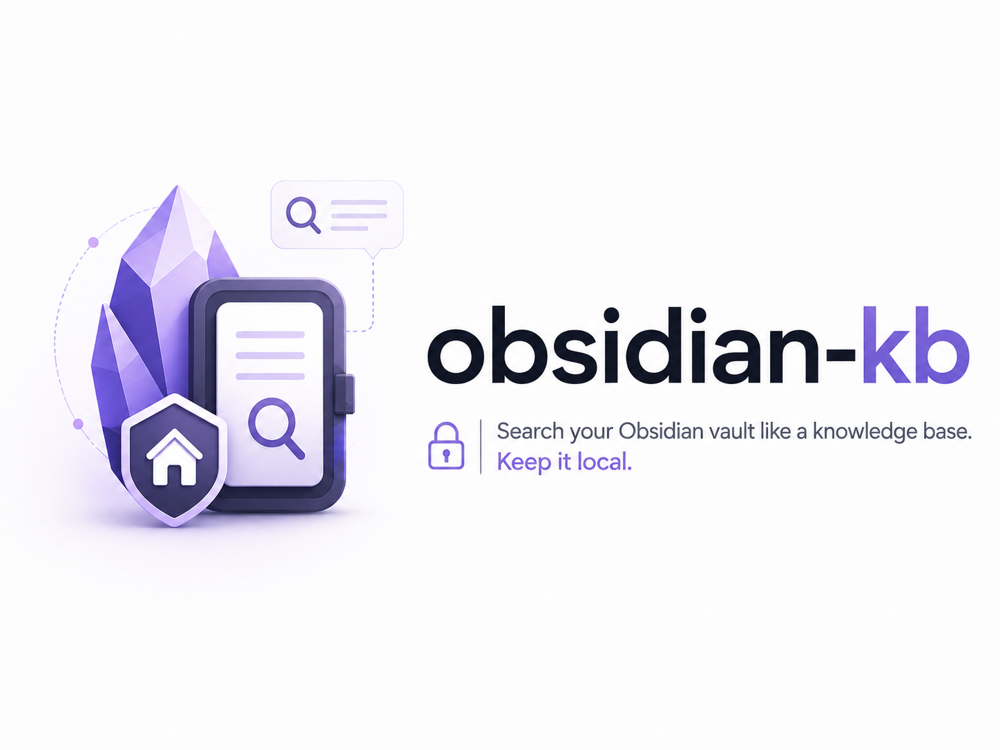

# OKB

<picture>
  <source media="(prefers-color-scheme: dark)" srcset="assets/obsidian-kb-logo.png">
  <source media="(prefers-color-scheme: light)" srcset="assets/obsidian-kb-logo-light.png">
  
</picture>

Desktop-only Obsidian plugin for `obsidian-kb`, the local Obsidian Knowledge
Base search service.

OKB is not a standalone search engine. It is an Obsidian UI and lifecycle
wrapper around the separate `obsidian-kb` CLI, which must be installed on the
same machine. On desktop, OKB starts `obsidian-kb serve` as a local external
process and talks to it over localhost HTTP.

OKB adds a right-side panel for searching the current vault, finding notes
related to the active note, and refreshing the local `obsidian-kb` index from
inside Obsidian.

## What It Does

- Starts or connects to `obsidian-kb serve`.
- Initializes `.obsidian-kb.toml` for the current vault from plugin settings.
- Searches the current vault through `POST /search`.
- Finds notes related to the active note through `/mcp` and the `related` tool.
- Refreshes the local index with `POST /index/refresh`.
- Opens result notes directly in Obsidian.
- Stops only the `obsidian-kb serve` process started by the plugin. A service
  started manually in a terminal is left running.

## Requirements

- Obsidian Desktop. OKB does not support Obsidian Mobile.
- The `obsidian-kb` CLI installed locally on the same computer.

The plugin is desktop-only because it uses Electron/Node.js process APIs to
launch and manage `obsidian-kb serve`. Mobile Obsidian cannot spawn that local
process, and the plugin release does not bundle the `obsidian-kb` executable.

## Runtime Model

OKB has two parts at runtime:

- The Obsidian plugin assets: `manifest.json`, `main.js`, and `styles.css`.
- The external `obsidian-kb` binary, installed separately and launched as
  `obsidian-kb serve`.

When auto-start is enabled, OKB starts the service from inside Obsidian. If an
`obsidian-kb serve` instance is already running, OKB can connect to it instead.
On shutdown, OKB only stops the process it started itself; a service started
manually in a terminal is left running.

## Install `obsidian-kb`

On macOS with Homebrew:

```bash
brew install dgalichet/tap/obsidian-kb
```

Or download the matching archive from the
[latest obsidian-kb release](https://github.com/dgalichet/obsidian-kb/releases/latest)
and put the `obsidian-kb` binary on your `PATH`.

The plugin checks the usual macOS package-manager locations when launching the
service, including `/opt/homebrew/bin/obsidian-kb` and
`/usr/local/bin/obsidian-kb`. If your binary is elsewhere, set the
`obsidian-kb binary` field in OKB settings to the absolute path returned by:

```bash
which obsidian-kb
```

## Install the Plugin

For local development, build the plugin and copy or symlink this directory into:

```text
<vault>/.obsidian/plugins/okb/
```

Then enable OKB from Obsidian's community plugins settings.

For manual release installation, copy these release assets into the same
`okb` plugin folder:

- `manifest.json`
- `main.js`
- `styles.css`

### Install With BRAT

BRAT can install OKB directly from GitHub once a release has been published.
It only installs the Obsidian plugin assets; you still need to install the
`obsidian-kb` CLI separately.

1. Install and enable
   [Obsidian42 - BRAT](https://github.com/TfTHacker/obsidian42-brat) from
   Obsidian's community plugins.
2. Run **BRAT: Add a beta plugin for testing** from the command palette.
3. Enter this repository URL:

   ```text
   https://github.com/dgalichet/obsidian-kb-plugin
   ```

4. Choose the latest version when BRAT asks which version to install.
5. Enable **Obsidian Knowledge Base** from Obsidian's community plugins list.

## First-Time Setup

1. Open **Settings -> Community plugins -> OKB**.
2. Confirm the `obsidian-kb binary` path, or leave it as `obsidian-kb` when the
   command is on `PATH` or installed with Homebrew.
3. Leave `Vault path` empty to use the current desktop vault, or set an explicit
   path when needed.
4. Optionally set a custom `Configuration file` path passed as `--config`.
5. Optionally set a custom `Index directory` path passed to
   `obsidian-kb init --index-dir`.
6. Click **Initialize** to run `obsidian-kb init --vault <vault>`.
7. Optionally configure search tuning, PDF indexing, and excluded headings from
   the same settings tab, then click **Apply config**.
8. Start the service from the same settings tab, or leave auto-start enabled.
9. Open the OKB side panel and refresh or rebuild the index from the Index tab.

The default `obsidian-kb` config file is `.obsidian-kb.toml`, and the default
sidecar index directory is `<vault>/.obsidian-kb`.

## Locality And Security

OKB talks to a local HTTP service on `127.0.0.1` by default. The companion
`obsidian-kb` CLI indexes local vault files and stores retrieval data locally.
OKB does not call hosted LLM APIs, does not send vault content to a remote
service, and does not replace Obsidian's files.

## Development

```bash
npm install
npm run dev
```

For a production bundle:

```bash
npm run build
```

## Releasing

The Obsidian plugin id is `okb`. For a GitHub release, attach:

- `manifest.json`
- `main.js`
- `styles.css`

The release tag must match `manifest.json`'s `version` exactly.

The release contains only the Obsidian plugin assets. Users must install
`obsidian-kb` separately before OKB can start or connect to the local service.

Releases are published by GitHub Actions when pushing a version tag in the
`vX.Y.Z` format. The tag must point to a commit reachable from `main`, and the
`X.Y.Z` part must match `package.json` and `manifest.json`.

```bash
npm version patch
git push origin main --follow-tags
```

The release workflow builds the plugin and uploads the Obsidian release assets:
`main.js`, `manifest.json`, and `styles.css`.

## License

Licensed under either of:

- Apache License, Version 2.0
- MIT license

at your option.
